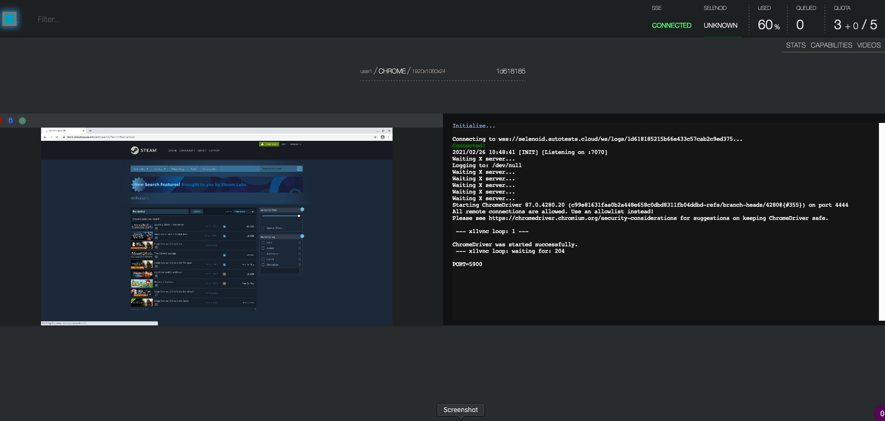
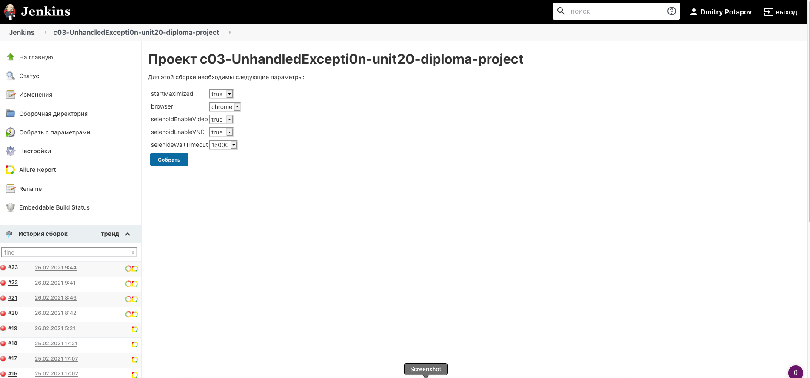
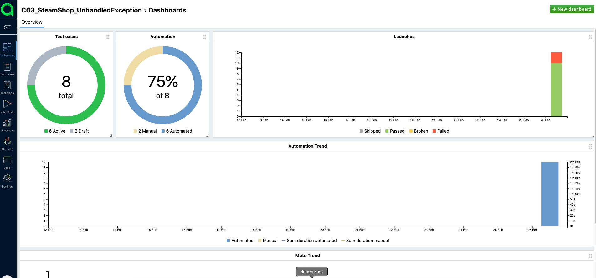
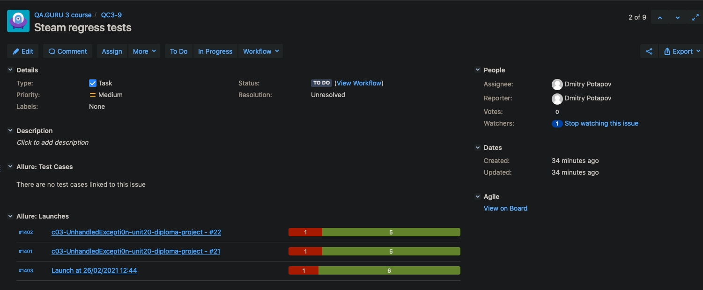

# qaguru-course

Repository contains lessons from QA Guru course ga.guru. Each branch contains finished homework for lessons. A final 
branch contains completed project which you can use for your automation purposes. 

Technologies involved:

- java
- gradle
- Selenide (Automation framework based on Selenium)
- Selenoid (Virtualization system based on the docker)
- Junit5 + multi-threading runs
- Allure (+Allure test ops) test report system.
- Jira integration / Jenkins integration
- Telegram piechart reporting library integration

How-To:

You can run tests from a local machine (or your IDE) or by Selenoid. Just choose it in Props file. All Props file 
variables can be also passed in system variables and have the highest priority to use (if we have defined option from system 
variables and in a file, system vars have a higher priority). To pass variables to system (or to CI) just write 
-DoptionName=optionValue (for Example: -DrunViaSelenoid=true) in gradle execution command line.

Define how much threads to run you can in build-gradle file via junit.jupiter.execution.parallel.config.fixed.parallelism
 option.

All steps are decomposed to steps-files. Locators for elements defined also in step-files. For future work you can
move all locators in page-object files.

Selenoid run:

Allure free version:

Jenkins run:

Allure enterprise edition (Allure test ops):

Telegram piechart reporting:

Jira integration:

